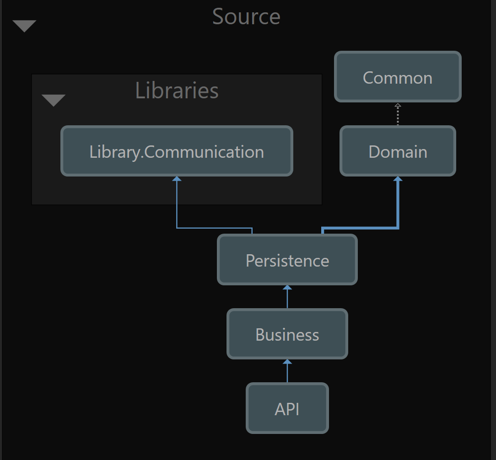
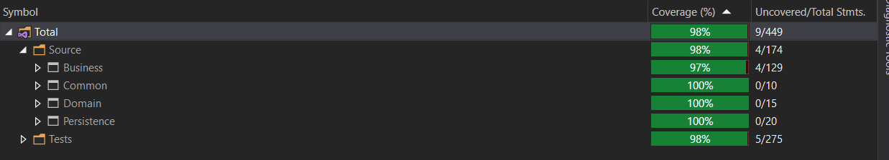

# Product service
### [View on heroku](https://undabot-product-service.herokuapp.com/api/index.html) 

The app should be implemented using .NET Core Web API.

It should contain one HTTP endpoint which accepts GET request with 3 optional query params

* Max price of product
* Size of product
* List of keywords to be highlighted with <em></em> HTML tags.
	* List has comma (,) as separator

Products are provided on [Mocky](http://www.mocky.io/v2/5e307edf3200005d00858b49) which acts like our source DB

### Endpoint response design:
* All products if request has no params
* Filtered subset of products if request has filter params (max price, size)
* Filter object which contains following:
  * Minimum price of product
  * Maximum price of product
  * Ten most common words in product description (not including actual top 5 most common words)
* Modified description that has emphasized words from highlight query parameter with HTML tag.

### Start

Clone repo

Make sure you have admin rights

# Backend project:
## Technologies and packages: 
* .Net Core 3.1
* MediatR
* Fluent validation
* Swagger 

## Architecture

## Build and run:
I was using VS19 so if you're using something else say VSCode you'll have to use CLI probably to first restore nuget packages and then run startup project
* Open project
* Set API project as startup
* Create appsettings.Development.json -> Use appSettings.json as cook-book
* Start https://localhost:44378/api/index.html

### To run test
* Open test project and run unit tests or write `dotnet test`

#### Coverage:

 

# Other projects
Feel free to check out some other repositories on my github
